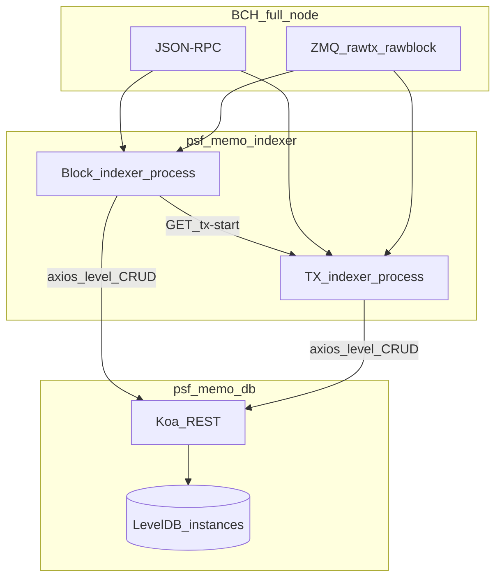

# Architecture

## System context



## Two-process indexer design

The indexer splits work the same way as [psf-slp-indexer-g2](https://github.com/Permissionless-Software-Foundation/psf-slp-indexer-g2):

| Process | Responsibility | Why separate |
|---------|----------------|--------------|
| **Block indexer** | Historical catch-up (IBD) and confirmed blocks via ZMQ | Heavy, sequential block work; must finish before mempool indexing is trustworthy for “at tip” |
| **TX indexer** | Unconfirmed transactions via ZMQ | High volume, duplicate ZMQ events; isolated so IBD memory/CPU does not contend with mempool flood |

Coordination is deliberately minimal: after IBD, the block indexer issues `GET http://{TX_REST_API_IP}:{TX_REST_API_PORT}/tx-start`. The TX indexer polls that flag every two seconds until set, then subscribes to ZMQ.

**Tradeoff:** No shared memory or message queue between processes—only HTTP and the database. Simplicity and operational parity with SLP outweigh lower latency startup.

## Clean Architecture (indexer)

Both repos follow [Clean Architecture](https://christroutner.github.io/trouts-blog/blog/clean-architecture): dependencies point inward; framework and I/O live at the edges.

### psf-memo-indexer layers

```text
Entry points (framework)
  psf-memo-block-indexer.js
  psf-memo-tx-indexer.js
        │
        ▼
Controllers
  keyboard.js          — graceful stop (q key)
  tx-rest-api.js       — Express /tx-start
        │
        ▼
Use cases
  index-blocks.js      — processBlock, processMemoTx (parallel per block)
  filter-block.js      — filterMemoTxs (parallel pre-check, block order preserved)
  state.js             — synced block height
  action-types/*.js    — per Memo action handlers
  utils.js
        │
        ▼
Adapters
  rpc.js               — full node JSON-RPC
  zmq.js               — @psf/bitcoincash-zmq-decoder
  transaction.js       — fetch tx + memo detection cache
  status-db.js, *-db   — axios → psf-memo-db
  tx-indexer.js        — start signal to TX process
  backup-db.js         — POST /level/backup
        │
        ▼
Libraries
  memo-parser.js       — OP_RETURN pushdata, signer address
  memo-codes.js        — action prefixes and limits
```

**Rule:** Use cases contain business rules (valid pushdata counts, reply parent links, like tips). Adapters only move bytes on the network or disk API.

### psf-memo-db layers

```text
index.js → bin/server.js (Koa)
        │
        ▼
Controllers
  rest-api/index.js
  rest-api/level/*     — CRUD handlers
  rest-api/health/
        │
        ▼
Use cases
  index.js             — minimal stub (parity with psf-slp-db)
        │
        ▼
Adapters
  level-db.js          — open/close LevelDB instances
  db-backup.js         — zip / restore
```

Level CRUD bypasses use cases intentionally—same as `psf-slp-db`’s `/level` controller calling `adapters.level.*Db.put` directly. The DB service is a thin persistence plane, not a domain model server.

## Repository layout (indexer)

| Path | Purpose |
|------|---------|
| `config/index.js` | Environment-driven settings |
| `src/lib/` | Pure protocol parsing (no I/O) |
| `src/adapters/` | External systems |
| `src/use-cases/` | Indexing orchestration and handlers |
| `src/controllers/` | HTTP and keyboard |
| `production/docker/` | Docker Compose, per-service Dockerfile and `.env` |
| `test/unit/` | Mocha + c8 |

## Repository layout (database)

| Path | Purpose |
|------|---------|
| `bin/server.js` | Koa bootstrap (mirrors psf-slp-db) |
| `config/env/` | `SVC_ENV` profiles |
| `src/adapters/level-db.js` | Twelve LevelDB stores under `leveldb/current/` |
| `src/controllers/rest-api/level/` | Generic CRUD + status + backup routes |
| `leveldb/current/{name}/` | Runtime data (gitignored) |
| `leveldb/zips/` | Epoch backups |

## LevelDB schema (summary)

Each store is a separate LevelDB with JSON values. Keys are txids, addresses, or composite strings depending on entity. Full detail: [psf-memo-db.md](./psf-memo-db.md).

| Store | Typical key | Value role |
|-------|-------------|------------|
| `status` | `status` | `syncedBlockHeight`, `chainBlockHeight`, `startBlockHeight` |
| `posts` | txid | Author address, text, timestamp |
| `postParents` | child txid | Parent txid (reply) |
| `postChildren` | `parentTxid:childTxid` | One reply link per parent–child pair |
| `likes` | like txid | Post txid, liker, optional tip |
| `names` | address | Display name + provenance txid |
| `profiles` | address | Profile text |
| `profilePics` | address | Avatar URL |
| `follows` | `follower:followeePkHash` | Follow/unfollow event |
| `rooms` | composite | Topic posts and topic follows |
| `processErrors` | txid | Validation / parse failures |
| `ptxs` | txid | Idempotency marker (already processed) |

## External dependencies

| Package | Used by | Role |
|---------|---------|------|
| `@psf/bch-js` | Indexer | Script decompile for signer address; optional REST |
| `@psf/bitcoincash-zmq-decoder` | Indexer | Decode `rawtx` / `rawblock` ZMQ messages |
| `zeromq` | Indexer | Subscribe to full node |
| `@chris.troutner/retry-queue` | Indexer | Retry RPC on transient failure |
| `axios` | Indexer | psf-memo-db REST client |
| `p-queue` / `p-retry` | Indexer | Parallel block filter and parallel per-tx processing within a block |
| `express` | Indexer | TX indexer control API |
| `level` | psf-memo-db | Embedded JSON LevelDB |
| `koa` + `koa-router` | psf-memo-db | REST server |

**Not used:** `slp-parser`, Lokad ID checks, DAG sorting, token UTXO graphs.

## Deployment topology

```text
production/docker/
├── docker-compose.yml
├── memo-db/          → build context: ../../psf-memo-db
├── block-indexer/    → build context: indexer repo root
└── tx-indexer/
```

Volumes mount `.env` and start scripts per service, matching the SLP production pattern. LevelDB data can persist under `production/data/leveldb`.
