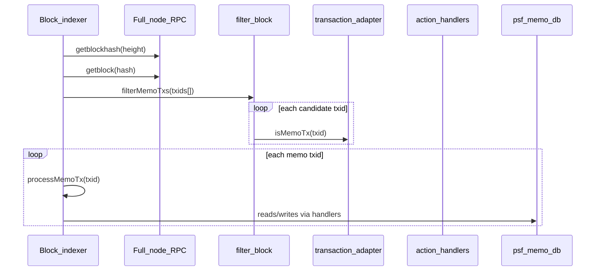

# Theory of Operation

This document walks through how the indexer behaves at runtime—from cold start through steady-state chain following—including the Memo-specific parsing rules.

## Prerequisites

1. **BCH full node** with RPC and ZMQ enabled (`rawtx`, `rawblock` on the configured port, default `28332`).
2. **psf-memo-db** listening (default `http://localhost:5021`).
3. Environment variables in `.env` or Docker-mounted `.env` files (see `.env-example`).

## Phase 1: Initialization

Both indexer processes:

1. Construct `Adapters`, `UseCases`, and `Controllers`.
2. Block indexer enables keyboard listener (`q` stops after current block).
3. TX indexer starts Express on `TX_REST_API_PORT` and waits for `/tx-start`.

**Status bootstrap** (`status-db.js`):

- `GET /level/status/status` from psf-memo-db.
- If missing (fresh DB), create:

```json
{
  "startBlockHeight": START_BLOCK_HEIGHT - 1,
  "syncedBlockHeight": START_BLOCK_HEIGHT - 1,
  "chainBlockHeight": <current RPC block count>
}
```

If `EXIT_ON_MISSING_BACKUP=true` and status is missing, the process exits instead of reinitializing—same safety valve as the SLP indexer when a backup is expected but absent.

## Phase 2: Initial Block Download (IBD)

Only the **block indexer** runs IBD.

```text
nextHeight = syncedBlockHeight + 1
tip        = RPC getblockcount

while nextHeight <= tip:
    processBlock(nextHeight)
    updateIndexedBlockHeight(nextHeight)
    optionally backup every 1000 blocks
    nextHeight++
```

### Per-block pipeline (`index-blocks.processBlock`)



**Step 1 — Fetch block:** `getblock` returns the list of transaction ids in the block (verbosity 1).

**Step 2 — Filter:** `filterMemoTxs` runs up to 20 concurrent `isMemoTx` checks (`p-queue`). Each check loads the transaction (with in-memory cache in `transaction.js`) and scans **all outputs** for a Memo `OP_RETURN`.

**Why scan all outputs?** Unlike SLP, which conventionally places token data in `vout[0]`, Memo actions may appear in any output’s `scriptPubKey`. The Go reference iterates every `TxOut`.

**Step 3 — Process:** For each Memo txid, `processMemoTx` runs sequentially within the block (no DAG sort—Memo social actions do not form token-like dependency chains within a block).

## Phase 3: Processing a single Memo transaction

### Idempotency

Before heavy work, the indexer checks `GET /level/ptx/{txid}`. If present, the tx is skipped. After successful handling, it `POST`s a ptx record `{ processedAt, blockHeight }`.

**Nuance:** If a handler partially fails mid-tx, v1 does not roll back prior writes in that tx. The Go indexer uses richer DB transactions; PSF v1 relies on idempotency only at tx boundaries. See tradeoffs doc.

### Signer address

Memo actions are attributed to the **first P2PKH input** that yields an address from the unlocking script (`getSignerAddress` in `memo-parser.js`, backed by `@psf/bch-js` where possible).

If no address is found:

- Log `processErrors` with reason.
- Skip action handlers (no anonymous posts in v1).

This mirrors the Go `SetLockHash` loop over inputs.

### OP_RETURN decoding

`parseScriptPushDatas` walks Bitcoin script bytes (push opcodes `0x01`–`0x4e`, `OP_RETURN 0x6a`, etc.) and collects pushdata buffers.

A Memo action is recognized when **any** pushdata begins with:

```text
0x6d <action_byte>
```

`decodeMemoOpReturn` returns `{ action, prefix, pushDatas }` where `action` is a string key (`post`, `reply`, `like`, …) mapped in `memo-codes.js`.

### Handler dispatch

`dispatchMemoAction` routes to `src/use-cases/action-types/*.js`. Each handler:

1. Validates pushdata count and field sizes (against `MAX_POST_SIZE` etc. from Go `memo.go`, typically 65000 bytes in modern limits).
2. On validation failure: write `processErrors`, return without throwing (invalid Memo txs do not halt the block).
3. On success: `POST` / `PUT` to the appropriate `/level/{entity}` route.

### Multi-output transactions

If one transaction contains multiple Memo `OP_RETURN` outputs, each decoded output dispatches separately in a loop. Rare in practice but supported.

## Action-specific behavior (v1)

| Action | Pushdata layout | Side effects beyond primary store |
|--------|-----------------|-----------------------------------|
| `setName` | prefix + UTF-8 name | `names` by address |
| `post` | prefix + message | `posts` by txid; skip create if post exists |
| `reply` | prefix + 32-byte parent hash + message | `postParents`, `postChildren`, then post body |
| `like` | prefix + 32-byte post hash | `likes`; optional `tip` satoshis to post author outputs |
| `setProfile` | prefix + text | `profiles` |
| `follow` / `unfollow` | prefix + 20-byte pk hash | `follows` keyed by follower and followee |
| `setProfilePic` | prefix + URL | `profilePics` |
| `topicMessage` | prefix + topic + message | post + `rooms` index |
| `topicFollow` / `topicUnfollow` | prefix + topic name | `rooms` follow record |

Like-tip logic: if the liked post exists and the liker is not the author, outputs paying the author’s address are summed (values converted from BCH decimal to satoshis) and stored on the like record.

## Phase 4: IBD completion and TX indexer handoff

When `nextBlockHeight > tip`:

1. Block indexer connects ZMQ.
2. `GET /tx-start` on TX indexer.
3. Enters ZMQ block loop (500 ms sleep, `rawblock` queue).

TX indexer:

1. Already listening on Express.
2. After `/tx-start`, connects ZMQ and processes `rawtx`.
3. Maintains `seenTxs` Set + FIFO queue capped at `seenTxMax` to drop duplicate ZMQ notifications cheaply before hitting `ptxDb`.
4. Calls the same `processMemoTx` with `blockHeight = chain tip + 1` for unconfirmed txs.

## Phase 5: Steady state

| Event source | Process | Behavior |
|--------------|---------|----------|
| New block (ZMQ) | Block indexer | Resolve height from block header, update `status`, `processBlock` |
| New mempool tx (ZMQ) | TX indexer | Dedupe → `processMemoTx` |
| Every 1000 blocks | Block indexer | `POST /level/backup` with `{ height, epoch: 1000 }` |

### Backups

`psf-memo-db` closes LevelDB files, zips `leveldb/current` to `leveldb/zips/memo-indexer-{height}.zip`, reopens DBs. Old zips are pruned per `BACKUP_QTY`.

Restore (`POST /level/restore`) unzips and **exits the process**—expect process manager restart, same as SLP.

## Memo vs SLP detection (operational difference)

| | SLP indexer | Memo indexer |
|---|-------------|--------------|
| Detection | Lokad `534c5000` + `slp-parser` | Prefix `6d` + action byte |
| Output index | Assumes `vout[0]` for token data | Any vout |
| Ordering | DAG sort within block | Sequential tx order |
| State model | Token UTXOs, balances | Social graph documents |

## Failure and retry behavior

- **RPC:** `RetryQueue` and `p-retry` (5 attempts) on block filter operations.
- **DB HTTP:** Errors bubble up; block processing logs and throws on `processMemoTx` failure.
- **Invalid Memo payload:** Logged to `processErrors`; block continues.
- **Keyboard `q`:** Block indexer exits after finishing current block.

## Configuration reference

| Variable | Default | Effect |
|----------|---------|--------|
| `PSF_MEMO_DB_URL` | `http://localhost:5021` | All DB adapters |
| `START_BLOCK_HEIGHT` | `525000` | Genesis for indexer state |
| `RPC_*` / `ZMQ_PORT` | see `.env-example` | Full node |
| `TX_REST_API_PORT` | `5455` | TX control (SLP uses 5454) |
| `seenTxMax` | `100000` | Mempool dedupe set size |
| `txCacheMax` | `100000` | RPC tx cache in transaction adapter |
